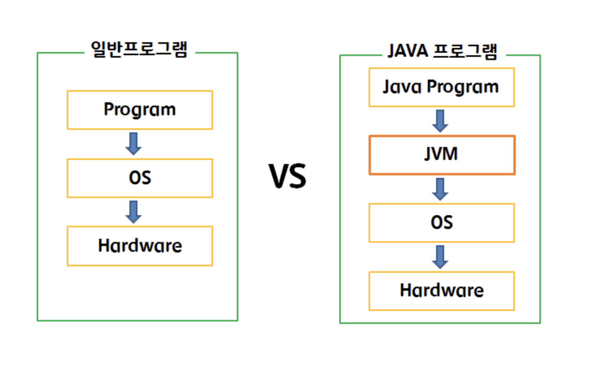
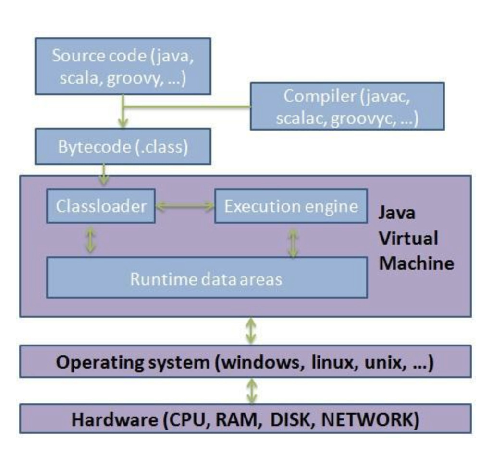
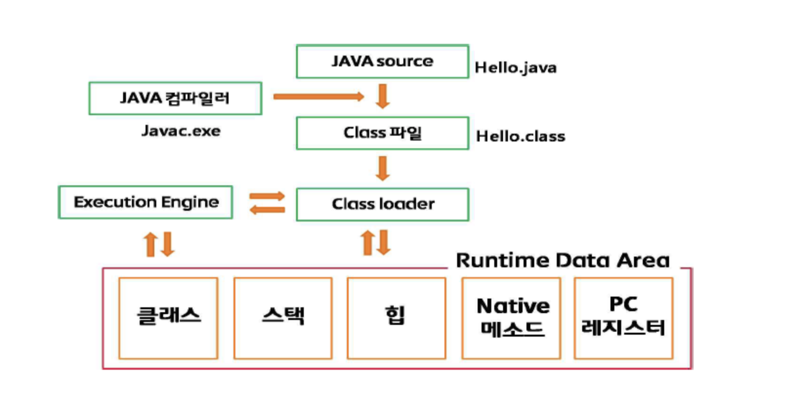

# JVM

JVM(Java Virtual Machine)을 어떻게 정의할 것인가 고민하기에 앞서 기본적 JVM 원어로부터 알아보겠습니다. JVM은 물리적인 형태가 아닌 소프트웨어로서 하나의 개념으로 존재합니다. 이것이 "VIRTUAL"을 뜻하는 것입니다. 그리고 JVM은 독자적으로 작동할 수 있는 메커니즘과 구조를 가지고 있습니다. 이는 하나의 축약된 컴퓨터와 같은 의미에서 "MACHINE"이라는 단어가 조합된 것입니다.

그러나 "JVM"이 구체적으로 무엇이냐는 질문에 정확한 정의를 내린다기 보다는, 하나의 개념, 스펙(Specification)에 지나지 않는 즉, 어느 누구도 정확하고 자세한 설계도를 제공하지 않고 단지 이렇게 저렇게 해야 한다는 식의 표준화된 정의만으로 존재할 뿐입니다.

이러한 표준화된 정의가 나오면 각 JVM 벤더들(Oracle, IBM 등)은 이러한 표준에 맞도록 자신들의 JVM을 별도로 구현하여 사용하곤 합니다.

결국 JVM은 정의된 스펙을 구현한 하나의 독자적인 프로세스 형태로 구동되는 Runtime Instance라고 할 수 있습니다. 따라서 JVM의 역할은 개발자들이 작성한 Java 프로그램이나 Web 애플리케이션 Server(WAS) 등을 구별하지 않고 Java 프로그램의 범주에 들어가는 모든 것들을 실행시키는 기본 데몬을 JVM이라고 칭합니다.

Java에서 프로그램을 실행한다는 것은 컴파일 과정을 통하여 생성된 Class 파일을 JVM으로 로딩하고 ByteCode를 해석(interpret)하는 과정을 거쳐 메모리 등의 리소스를 할당하고 관리하며 정보를 처리하는 일련의 작업들을 포괄합니다. 이 때 JVM은 Thread 관리 및 Garbage Collection과 같은 메모리 정리 작업도 수행하게 됩니다.

 - Java Source: 사용자가 작성한 Java 코드이다
 - Java Compiler: Java Source 파일을 JVM이 해석할 수 있는 Java Byte Code로 변경한다.
 - Java Byte Code: Java Compiler에 의해 수행될 결과물이다(확장자 .class 파일)
 - Class Loader: JVM 내로 .class 파일들을 Load하여 Loading된 클래스들을 Runtime Data Area에 배치된다.
 - Execution Engine: Loading된 클래스의 Bytecode를 해석(interpret)한다.
 - Runtime Data Area: JVM이라는 프로세스가 프로그램을 수행하기 위해 OS에서 할당받은 메모리 공간이다.

<질문>

<출처>
   
