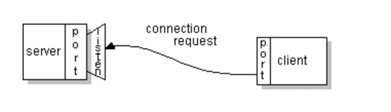
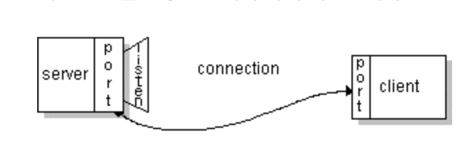
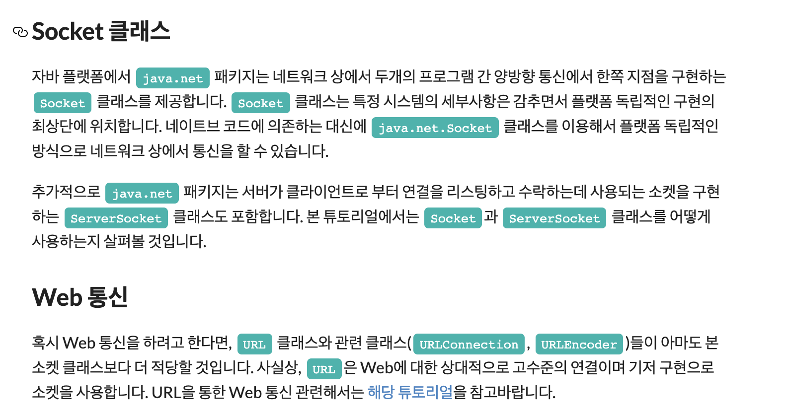

# 소켓이란 무엇인가?

소켓 통신

일반적으로 서버는 특정 포트가 바인딩된 소켓를 가지고 특정 컴퓨터 위에서 돌아갑니다. 해당 서버는 클라이언트의 연결 요청을 소켓을 통해 리스닝하면서 그냥 기다릴 뿐이죠.

클라이언트는 서버가 떠 있는 머신의 호스트네임과 서버가 리스닝하고 있는 포트 번호를 알고 있습니다. 따라서 클라이언트는 이 호스트 네임과 포트를 통해서 서버와 연결을 시도하게 됩니다. 또한 클라이언트는 서버 상대로 자신을 식별시켜주기 위해서 연결동안 사용될 로컬 포트에 바인딩됩니다. 이 포트 바인딩 작업은 보통 시스템에 의해서 이뤄집니다.

만약에 모든 게 순조롭게 이뤄진다면 서버는 연결을 수락하게 됩니다. 수락하자마자, 서버는 동일한 로컬 포트에 바인딩된 새로운 소켓을 얻게 되며 클라이언트의 주소와 포트로 세팅된 리모트 엔드 포인트를 가지게 됩니다. 서버가 별개의 새로운 소켓이 필요한 이유는 연결된 클라이언트의 요청을 처리하면서, 동시에 기존의 소켓을 통해서는 지속적으로 연결 요청을 받아야 하기 때문입니다.

클라이언트 입장에서는 만약에 연결이 수락되면 소켓은 성공적으로 생성되며 클라이언트는 서버와 통신하기 위해서 소켓을 사용할 수 있게됩니다.

클라이언트와 서버는 이제 소켓에 데이터를 쓰거나 읽음으로써 통신할 수가 있게됩니다.

소켓의 정의
소켓은 네트워크 상에서 돌아가는 두 개의 프로그램 간 양방향 통신의 하나의 엔트 포인트입니다. 소켓은 포트 번호에 바인딩되어 TCP 레이어에서 데이터가 전달되야하는 어플리케이션을 식별할 수 있게 합니다.

엔드 포인트란?
여기서 엔드 포인트라 함은 아이피 주소와 포트 번호의 조합을 의미합니다. 모든 TCP 연결은 2개의 앤드 포인트로 유일하게 식별되어질 수 있습니다. 따라서 클라이언트와 서버 간 여러 개의 연결이 맺어질 수 있습니다.

<출처>
   - https://gmlwjd9405.github.io/2018/05/10/algorithm-quick-sort.html
   - https://ghd5262.tistory.com/25
   - https://zeddios.tistory.com/35
   