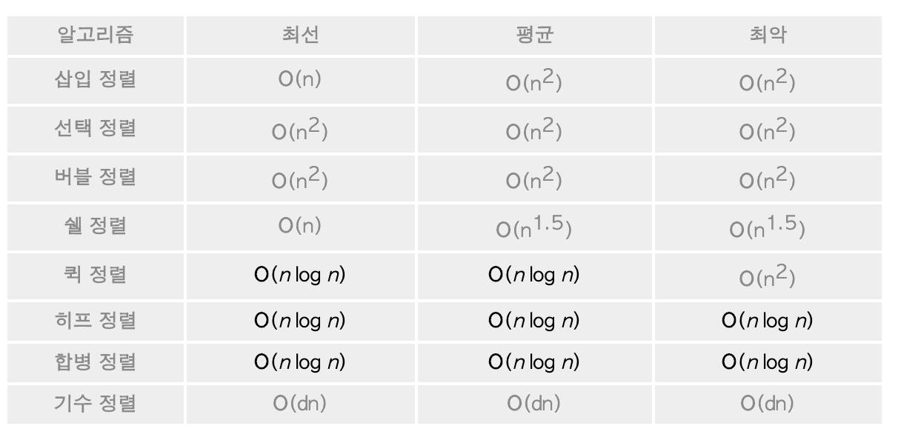

# sorting

주제에 앞서서 정렬에 관하여 간략하게 요악을 해보자

정렬(sorting)이란 순서없이 나열된 자료(record)를 특정한 키(key)값에 따라 오름차순이나 내림차순으로 자료를 재배열하는 것을 의미한다.

정렬은 자료 탐색에 있어서 필수적이다. 예를 들어 사전에서 단어를 찾을 때 알파벳순으로 정렬이 되어 있지 않다면 특정한 단어를 찾는 것을 거의 불가능하다. 비록 컴퓨터가 사람보다 속도는 더 빠르지만 정렬되어 있지 않는 자료에서는 탐색의 효율이 크게 떨어진다.

1. 내부정렬 -> 정렬하고자 하는 모든데이터를 메모리에 올려 정렬을 수행
2. 외부정렬 -> 정렬하고자 하는 데이터가 너무 크기 때문에 모든 데이터를 올려놓지 않은 상태에서 정렬한 이것을 다시 합하는 방식
3. 제자리정렬 -> 주어진 정렬데이터의 공간 외의 공간을 사용하는지 아닌지를 구분하는 경우가 있다. 주어진 공간 외에 추가적인 공간을 사용하지 않는 방식

(음.. 기수정렬 이런건 모르는뎅 알아보겠습니다!!)

목차
  1. Sorting Algorithm에서 stable 하다는 것은 무엇을 의미하나요
  2. Sorting Algorithm이 가짓수가 많은데 그 이유가 무엇일 것 같나요
  3. Quick sort에 대해서 설명해 줄 수 있나요

### 1. Sorting Algorithm에서 stable 하다는 것은 무엇을 의미하나요

동일한 Element가 있을 때 정렬 전의 순서와 정렬 후의 순서가 동일함을 보장하는 것이 Stable이다.

예를 들어 [{k: 4, v: 1}, {k: 3, v: 2}, {k: 3, v: 1}, {k: 2, v: 1}, {k: 5, v: 1}] 을 stable한 sorting algorithm을 이용한다면.

[{k: 2, v: 1}, {k: 3, v: 2}, {k: 3, v: 1}, {k: 4, v: 1}, {k: 5, v: 1}]가 된다. (k가 3인 동일한 정렬 기준을 가진 Element가 2개가 있지만 input된 순서 그대로 정렬되었다.)

### 2. Sorting Algorithm이 가짓수가 많은데 그 이유가 무엇일 것 같나요

sorting algorithm마다 expected(기대)되는 속도가 다르다.

<재호 질문>
1. 그럼 저기 위에 정렬중에 어떤 것이 stable 하고 stable 하지 않을까요?
2. 내부정렬에 대한 예와 외부 정렬에 대한 예를 말해보세요!
3. 
- 출처 : https://github.com/JaeYeopHan/Interview_Question_for_Beginner/blob/master/Network/README.md#%EC%9B%B9-%ED%86%B5%EC%8B%A0%EC%9D%98-%ED%81%B0-%ED%9D%90%EB%A6%84