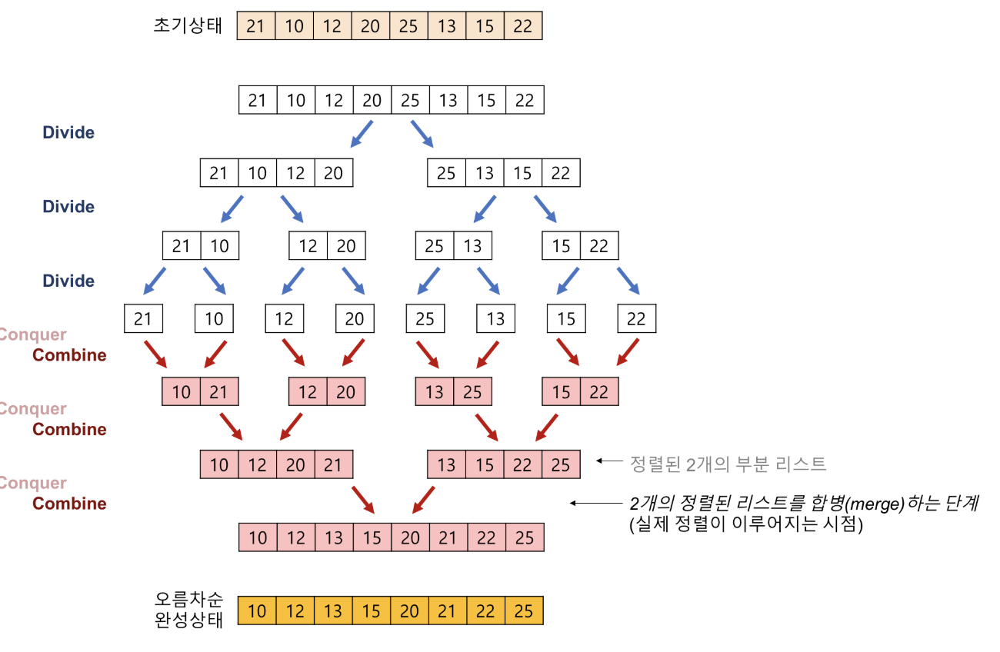
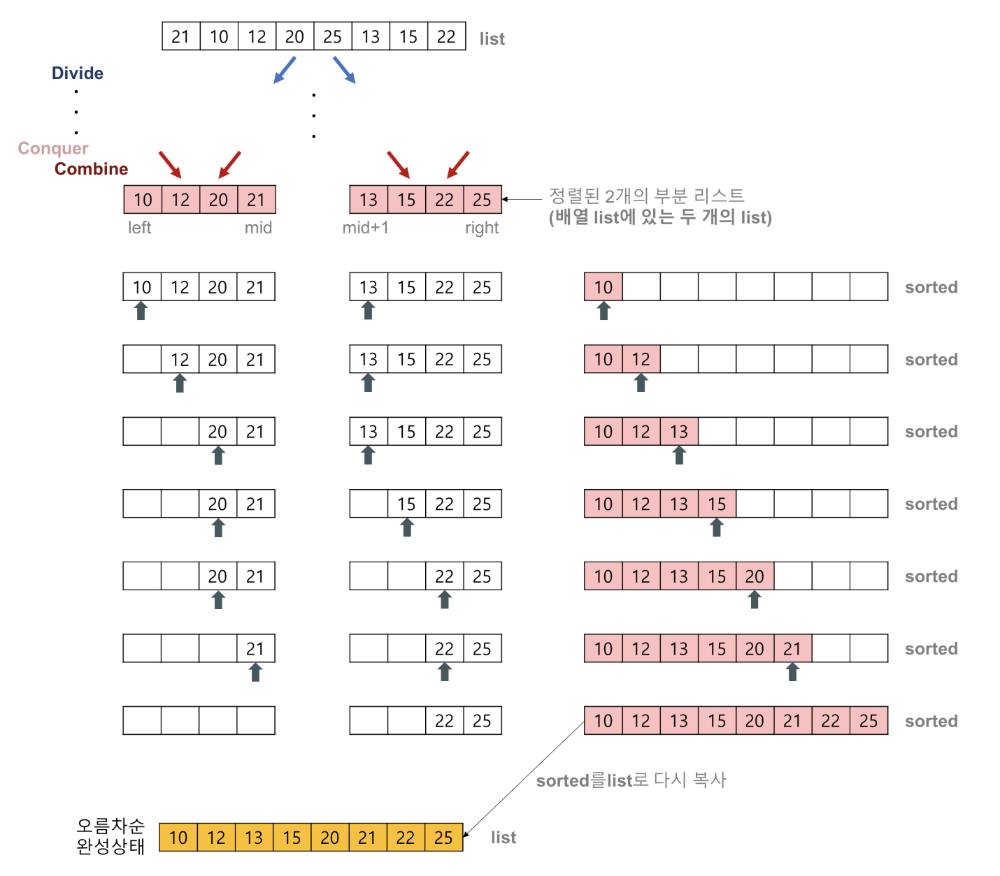
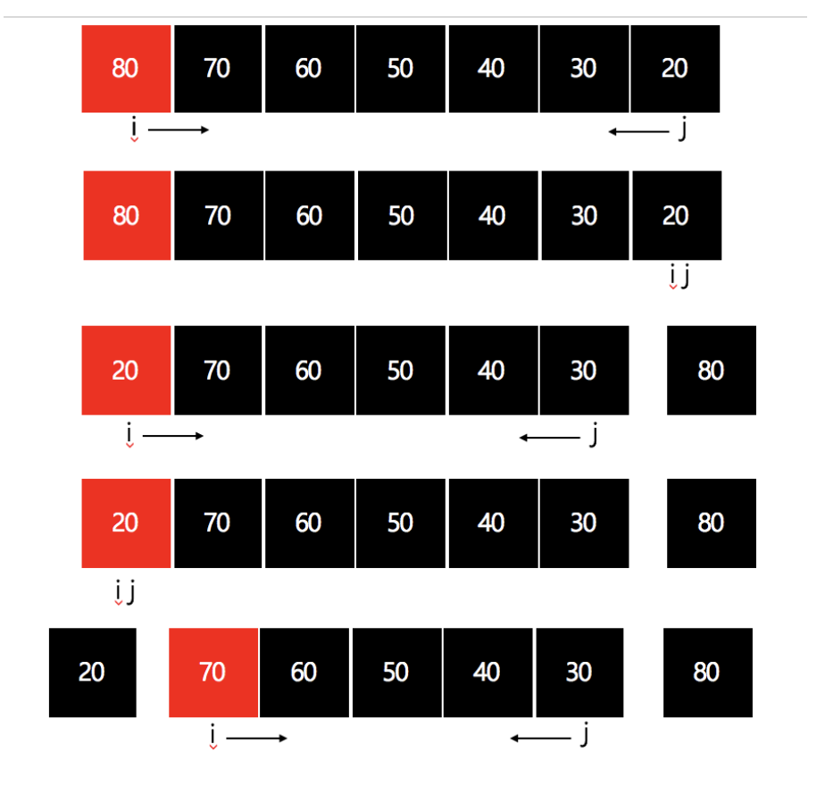
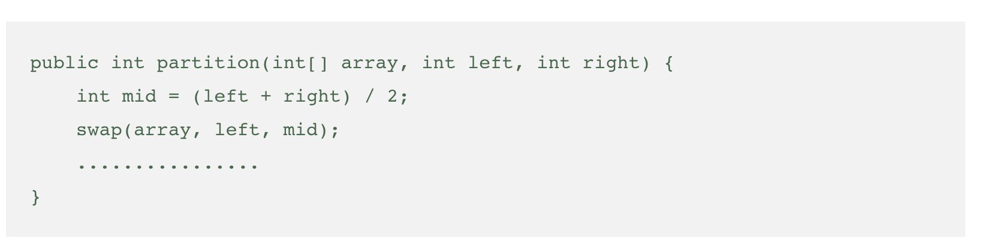
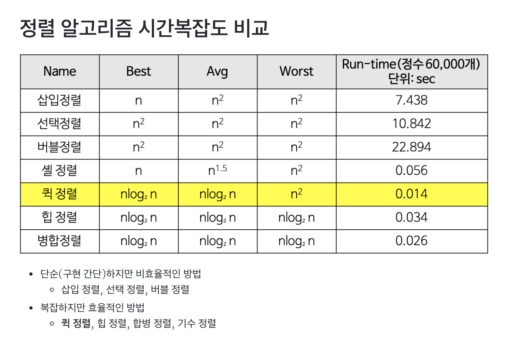

# sorting

주제에 앞서서 정렬에 관하여 간략하게 요악을 해보자

정렬(sorting)이란 순서없이 나열된 자료(record)를 특정한 키(key)값에 따라 오름차순이나 내림차순으로 자료를 재배열하는 것을 의미한다.

정렬은 자료 탐색에 있어서 필수적이다. 예를 들어 사전에서 단어를 찾을 때 알파벳순으로 정렬이 되어 있지 않다면 특정한 단어를 찾는 것을 거의 불가능하다. 비록 컴퓨터가 사람보다 속도는 더 빠르지만 정렬되어 있지 않는 자료에서는 탐색의 효율이 크게 떨어진다.

1. 내부정렬 -> 정렬하고자 하는 모든데이터를 메모리에 올려 정렬을 수행
2. 외부정렬 -> 정렬하고자 하는 데이터가 너무 크기 때문에 모든 데이터를 올려놓지 않은 상태에서 정렬한 이것을 다시 합하는 방식
3. 제자리정렬 -> 주어진 정렬데이터의 공간 외의 공간을 사용하는지 아닌지를 구분하는 경우가 있다. 주어진 공간 외에 추가적인 공간을 사용하지 않는 방식

(음.. 기수정렬 이런건 모르는뎅 알아보겠습니다!!)

목차
  1. Sorting Algorithm에서 stable 하다는 것은 무엇을 의미하나요
  2. Sorting Algorithm이 가짓수가 많은데 그 이유가 무엇일 것 같나요
  3. Quick sort에 대해서 설명해 줄 수 있나요

### 1. Sorting Algorithm에서 stable 하다는 것은 무엇을 의미하나요

동일한 Element가 있을 때 정렬 전의 순서와 정렬 후의 순서가 동일함을 보장하는 것이 Stable이다.

예를 들어 [{k: 4, v: 1}, {k: 3, v: 2}, {k: 3, v: 1}, {k: 2, v: 1}, {k: 5, v: 1}] 을 stable한 sorting algorithm을 이용한다면.

[{k: 2, v: 1}, {k: 3, v: 2}, {k: 3, v: 1}, {k: 4, v: 1}, {k: 5, v: 1}]가 된다. (k가 3인 동일한 정렬 기준을 가진 Element가 2개가 있지만 input된 순서 그대로 정렬되었다.)

### 2. Sorting Algorithm이 가짓수가 많은데 그 이유가 무엇일 것 같나요

sorting algorithm마다 expected(기대)되는 속도가 다르다.

속도가 아닌 Space Comlexity(공간 복잡도)가 고려대상이 될 수 있다. Merge sort(합병정렬)같은 경우 insertion sort(삽입 정렬)나 selection sort(선택 정렬)에 비해 추가 메모리 공간을 사용하기 때문

<왜? 합병정렬은 추가적인 메모리가 필요할까요???>

여기서 합병정렬에 대해서 간단히 알아보자

Stable한지 안한지에 따라 사용되어야 할 sorting algorithm이 다를 수 있다.

   - 분할(Divide): 입력 배열을 같은 크기의 2개의 부분 배열로 분할한다.
   - 정복(Conquer): 부분 배열을 정렬한다. 부분 배열의 크기가 충분히 작지 않으면 순환 호출 을 이용하여 다시 분할 정복 방법을 적용한다.
   - 결합(Combine): 정렬된 부분 배열들을 하나의 배열에 합병한다.

   - 2개의 정렬된 리스트를 합병(merge)하는 과정
   - 2개의 리스트의 값들을 처음부터 하나씩 비교하여 두 개의 리스트의 값 중에서 더 작은 값을 새로운 리스트(sorted)로 옮긴다.
   - 둘 중에서 하나가 끝날 때까지 이 과정을 되풀이한다.
   - 만약 둘 중에서 하나의 리스트가 먼저 끝나게 되면 나머지 리스트의 값들을 전부 새로운 리스트(sorted)로 복사한다.
   - 새로운 리스트(sorted)를 원래의 리스트(list)로 옮긴다.
   
   

** 새로운 리스트(sorted)를 원래의 리스트(list)로 옮긴다. ** 
이부분에서 새로운 메모리를 사용한다.

3. Quick sort에 대해서 설명해 줄 수 있나요

Quick sort는 Divide-and-Conquer paradigm을 이용해 정렬을 수행하는 정렬 알고리즘이며 그중에서도 Partitioning이라는 아이디어를 이용한다.

Partitioning이란 Pivot element를 기준으로 왼쪽은 Pivot보다 작거나 같은 것을 모아주고 오른쪽은 Pivot보다 크거나 같은것을 모아주는 것을 말한다.

Partitioning을 재귀적으로 진행하다보면 정렬이 완료된다.

<퀵소트의 개념>
   - 하나의 리스트를 피벗(pivot)을 기준으로 두 개의 비균등한 크기로 분할하고 분할된 부분 리스트를 정렬한 다음, 두 개의 정렬된 부분 리스트를 합하여 전체가 정렬된 리스트가 되게 하는 방법이다.
   - 퀵 정렬은 다음의 단계들로 이루어진다.
   1. 분할(Divide): 입력 배열을 피벗을 기준으로 비균등하게 2개의 부분 배열(피벗을 중심으로 왼쪽: 피벗보다 작은 요소들, 오른쪽: 피벗보다 큰 요소들)로 분할한다.
   2. 정복(Conquer): 부분 배열을 정렬한다. 부분 배열의 크기가 충분히 작지 않으면 순환 호출 을 이용하여 다시 분할 정복 방법을 적용한다.
   3. 결합(Combine): 정렬된 부분 배열들을 하나의 배열에 합병한다.
순환 호출이 한번 진행될 때마다 최소한 하나의 원소(피벗)는 최종적으로 위치가 정해지므로, 이 알고리즘은 반드시 끝난다는 것을 보장할 수 있다.

퀵소트의 최악의 조건은 n^2 이다. 이러한 조건은 정렬된 배열을 정렬하면 이렇게 된다.
이 경우에는 요소들이 역순으로 존재했을 때를 예로 들 수 있다.

기존 코드에서 피벗의 첫번째 요소와 중간 요소를 교환만 해주면 된다.

결과적으로 최악의 경우인 O(n^2) 를 피할 수 있다.

또한 다른 O(nlogn) 의 시간복잡도를 가지는 다른 소트보다 빠르다고 알려져있다.
그 이유는 먼 거리 교환 처리와 캐시 효율(한번 선택된 기준은 제외한다) 등으로 인해 웬만한 O(nlogn) 보다 빠르게 동작한다.

<참고>
배열별 속도

<재호 질문>
1. 그럼 저기 위에 정렬중에 어떤 것이 stable 하고 stable 하지 않을까요?

stable : 버블 정렬 ,삽입정렬 , 합병정렬
enstab : 선택정렬 , 힙정렬, 

2. 내부정렬에 대한 예와 외부 정렬에 대한 예를 말해보세요!
내부 정렬은 정렬할 자료를 메인 메모리에 올려서 정렬하는 방식이고 정렬 속도가 빠르지만 정렬할 수 있는 자료의 양이 메인 메모리의 용량에 따라서 제한된다.
내부 정렬 방식에는 교환 방식(Selection, Bubble, Quick), 삽입 방식(Insertion, Shell), 병합 방식(2-way 병합, n-way 병합), 분배 방식(Radix), 선택 방식(Heap, Tree) 등이 있다.
외부 정렬은 정렬할 자료를 보조 기억장치에서 정렬하는 방식이고 대용량의 보조 기억 장치를 사용하기 때문에 내부 정렬보다 속도는 떨어지지만 내부 정렬로 처리할 수 없는 대용량의 자료에 대한 정렬이 가능하다.
외부 정렬 방식에는 병합 방식(2-way 병합, n-way 병합) 이 있다.

3. 큌소트 최악의 조건을 해결하는 방법이 있을까?

중간으로 두기

<출처>
   - https://gmlwjd9405.github.io/2018/05/10/algorithm-quick-sort.html
   - https://ghd5262.tistory.com/25
   - https://zeddios.tistory.com/35
   