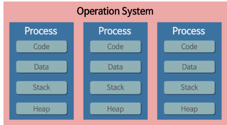
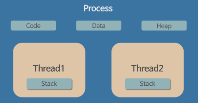

# process and thread

차이점을 찾는 의도

프로세스와 스레드에 대한 질문은 결국에는 운영체제가 시스템 자원을 어떤 단위로 할당하고 프로세스와 스레드는 이 자원을 어떻게 사용하느냐에 대해서 알고 있는지에
대한 질문입니다.

1. Process and thread

  - process
  컴퓨터에서 연속적으로 실행되고 있는 컴퓨터 프로그램
  메모리에 올라와 있고 실행되고 있는 프로그램의 인스턴스 (독립적인 개체 -> 메모리에 올리와 있지 않으면 프로그램(exe))
  운영체제로 부터 시스템 자원을 할당받는 작업의 단위
  즉, 동적인 개념으로 실행된 프로그램을 의미한다.

  => 그럼 어떤걸 할당 받을까?
  (CPU시간 , 운영되기위한 필요한 주소 공간, code,date stack, heap 의 구조로 되어 있는 독립된 메모리 영역)

프로세스는 각각 독립된 메모리 영역 (code, data,stack,heap 구조)을 할당받는다.
기본적으로 프로세스당 최소 1개의 스레드(메인스레드 )를 가지고 있다.
각 스레드 별로 별도의 주소 공간에서 실행되며, 한 프로세스는 다른 프로세스의 변수나 자료구조에 접근할 수 없다.

- thread
스레드란 한 프로세스 내에서 동작되는 여러 실행의 흐름으로 프로세스 내의 주소 공간이나 자원들을 같은 프로세스 내에 스레드끼리 공유하면서 실행된다.
따라서 한 쓰레드가 프로세스 자원을 변경하면 다른 이웃 쓰레드도 그 변경결과를 즉시 볼 수 있다.
하지만 교착상태에 빠질 수 있다.
나의 프로세스를 생성 했는데, 해당 프로세스가 하는 일은 두가지가 있다. 하나는 1부터 100까지 더하는 기능이고, 다른 하나는 다른 프로세스가 지금까지 더한 수를 전달하는 기능이다. 두개의 기능을 각가 다른 쓰레드에 할당 시켜서 작업처리 시간 향샹을 올릴 수 있다.

2. 멀티프로세스와 멀티쓰레드의 차이

멀티 프로세싱
-> 여러개 응용프로그램을 여러 개의 프로세스로 구성하여 각 프로세스가 하나의 작업을 처리하도록 하는 것이다.

장점
여러 개의 자식 프로세스 중에 하나에 문제가 발생하면 그 자식 프로세스만 죽는 것 이상으로 다른 영향이 확산되지 않는다.(크롬창)

단점
컨택스트 스위치에서 오버헤드
컨텍스트 스위치 과정에서 캐쉬 메모리 초기화 등 무거운 작업이 진행되고 많은 시간이 소모 되는 등의 오버헤드가 발생하게 된다.

프로세스는 각각의 독립된 메모리 영역을 할당받았기 때문에 프로세스 사이에서 공유하는 메모리가 없어 컨택스트 스위칭이 발생하면 캐쉬에 있는 모든 데이터를 모두 리셋하고 다시 캐쉬 정보를 불러와야 한다.

멀티 쓰레드

멀티 쓰레딩이란
-> 하나의 응용프로그램을 여러 개의 쓰레드로 구성하고 각 쓰레드로 하여금 하나의 작업을 처리하도록 하는 것이다.
-> 윈도우, 리눅스 등 많은 운영체제들이 멀티 프로세싱을 지원하고 있지만 쓰레딩을 기본으로 하고 있다.
-> 웹서버(was)는 대표적으로 멀티 쓰레드 응용 프로그램이다.  ??

장점
시스템 자원 소모 감소(자원의 효율성 증대)
프로세스를 생성하여 자원을 할당하는 시스템 콜이 줄어들어 자원을 효율적으로 관리할 수 있다.

시스템 처리량 증가(처리비용 감소)
프로세스 간의 통신보다 쓰레드 간 통신이 비용이 적으므로 통신 비용이 줄어들게 된다.
쓰레드 사이의 작업략이 적어 context Swiching이 빠르다.
쓰레드는 프로세스 내의 stack영역을 제외한 모든 메모리를 공유하기 때문에 통신의 부담이 적다.

단점
주의 깊은 설계가 필요하다. -> 미묘한 시간, 잘못된 변수 공유로 오류 발생 확률 증가
  race condition ( 두 명령어가 동시에 같은 장소를 엑세스 할때 수행결과를 예측 할수 없게 되는것 )

    멀티 스레드 프로그램은 예측 불가능
    실행 순서가 보장되지 않음
    언제나, 어디서나 문맥 교환 발생 가능
    스레드는 작은 변화에 매우 민감
    스레드는 즉시 시작하지 않을 수 있음
    하나의 스레드만 실행중인 경우 싱글 스레드의 실행시간이 개선되지 않고 오히려 지연될수 있음

 

디버깅이 까다롭다.

멀테 쓰레드의 경우 자원 공유의 문제가 발생한다.(동기화 문제)
하나의 쓰레드에 문제가 발생하면 프로세스가 영향을 받는다.

1. 멀티 프로세스 대신 멀티 쓰레드를 사용하는 이유는?

쉡게 설명하면 프로그램을 여러개 키는 것보다 하나의 프로그램안에서 여러 작업을 해결하는 것이다.

자원의 효율성 증대
멀티프로세스로 실행되는 작업을 멀티 쓰레드로 실행할 경우 프로세스를 생성하여 자원을 할당하는 시스템 콜이 줄어들어 자원을 효율적으로 관리할 수 있다.
-> 프로세스 간의 context switching시 단순히 cpu 레지스터 교체 뿐만 아니라 Ram과 CPU사이의 캐쉬 메모리에 대한 데이터까지 초기화되므로 오버헤드가 크기 때문

-> 쓰레드는 프로세스 내의 메모리를 공유하기 떄문에 독립적인 프로세스와 달리 쓰레드 간 데이터를 주고 받는 것이 간단해지고 시스템 자원 소모가 줄어들게 된다.

처리비용 감소 및 응답 시간 단축
프로세스 간의 통신(IPC)보다 쓰레드 간의 통신의 비용이 적으므로 작업들 간의 통신의 부담이 줄어든다.
->쓰레드는 stack 영역을 제외한 모든 메모리를 공유하기 때문

프로세스 간의 전환 속도보다 쓰레드 간의 전환 속도가 빠르다.
->Context Swithcing시 쓰레드는 stack 영역만 처리하기 떄문

<참고>
   - 동기화 문제  
  프로세스 안에는 여러개의 쓰레드가 형성되고 프로세스 안에 있는 영역을 공유하게 된다. 쓰레드 A,B,C가 있다고 가정하면
  공유하고 있는 프로세스 자원에 동기화 문제가 발생할 수 있다.
  즉 쓰레드 A,B,C의 실행순서는 스케줄러가 상호아에 맞게 결정되기 때문에 동기화 문제 발생
  교착상태 발생!

   - 쓰레드 간의 자원 공유는 전역 변수(데이터 세그먼트)를 이용하므로 함꼐 상용할 때 충돌이 발생 할 수 있다.

목차
  1. 한 프로세스가 다른 프로세스의 자원에 접근하려면 어떻게 해야 할까요?
  (프로세스간의 통신 IPC, inter-process communication)을 사용한다.
  ->프로세스 간 통신(Inter-Process Communication, IPC)이란 프로세스들 사이에 서로 데이터를 주고받는 행위 또는 그에 대한 방법이나 경로를 뜻한다.

  2. 왜 여러 프로세스(멀티 프로세스)로 할 수 있는 작업들을 굳이 하나의 프로세스에서 스레드로 나눠가면서 일처리를 할까요?
  운영체제는 시스템자원을 효율적으로 관리하기 위해서 스레드를 사용하는 것이다.

  자세히 말씀드리면 멀티 프로세스로 실행되는 작업을 멀티 스레드로 실행할 경우, 프로세스를 생성하여 자원을 할당하는 시스템 콜이 줄어들어 자원을 효율적으로 관리 할 수 있기 떄문이다. 뿐만아니라 프로세스 간의 통신보다 스레드 간의 통신의 부담도 줄어들기 때문이다.

  3. 컨텍스트 스위치란?
   구체적으로 동작 중인 프로세스가 대기를 하면서 해당 프로세스의 상태(context)를 보관하고 대기하고 있던 다음 순서의 프로세스가 동작하면서 이전에 보관했던 프로세스의 상태를 복구하는 작업을 말한다.  (pcb)

  4. 멀티 프로세스 대신 멀티 쓰레드를 사용하는 이유는?

듀얼 코어 and 2개의 프로세서

1개의 cpu 2개의 코어
2개의 cpu 

멀티프로세싱, 멀티 스레딩 예를 들어서 설명해봐라
- 프록시 서버  -> 멀티 스레팅은 프로시 서버를 각각 다바꿀수 있지만 멀티 프로세싱은 안된다 ( 공유자원)
- 메모리  -> 요즘에는 메모리가 많아져서 상관없지만 옛날에는 메모리가 돈이다.

쓰레드는 왜 스택(을 독립적으로 가지고 있어야 하느냐)이여야만 했느냐
-> 스택에 들어가는 건 -> 함수, 매개변수 ,지역변수 
-> 함수들이 독립적인 함수들이 있다 독립적인 일을 가능하게 한다. 그래서 스택부분을 독립적으로 놓은 것이다.

tcb,pcb

tcb (Task Control Block)
pcb (process Control Block)

<출처>
   - https://velog.io/@pa324/%EC%9A%B4%EC%98%81%EC%B2%B4%EC%A0%9C-Thread%EC%8A%A4%EB%A0%88%EB%93%9C-rqk2kafwhw
   - https://proneer.tistory.com/entry/%EB%A9%80%ED%8B%B0%ED%94%84%EB%A1%9C%EC%84%B8%EC%8B%B1-%EB%A9%80%ED%8B%B0%ED%94%84%EB%A1%9C%EA%B7%B8%EB%9E%98%EB%B0%8D-%EB%A9%80%ED%8B%B0%ED%83%9C%EC%8A%A4%ED%82%B9-%EB%A9%80%ED%8B%B0%EC%8A%A4%EB%A0%88%EB%93%9C%EC%97%90-%EA%B4%80%ED%95%98%EC%97%AC
   -    
