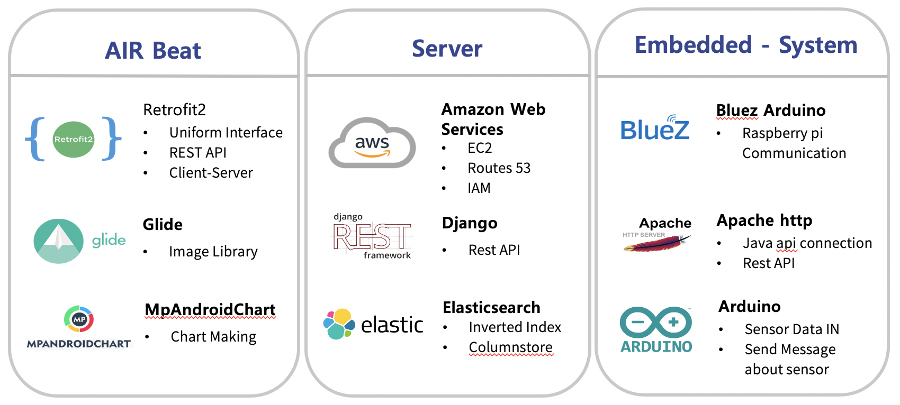
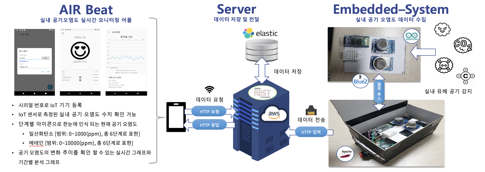

# 2019 Capstone Sejong University
   - 2019년 세종대학교 학술제 대상
   - 2019년 세종대학교 창의설계경진대회 입상
   

## 1) 서비스 설명
일산화탄소를 비롯한 실내 대기 오염물질로 인한 사고 사례들이 발생함에 따라(아래 사례 참고), 실내 공기 상태에 대한 지속적인 관심과 모니터링에 대한 필요성이 증가하고 있다. 이에 IoT 센서와 Elasticsearch를 활용한 빅데이터 수집 및 분석을 통해 실시간으로 실내 공기 상태에 대해 모니터링이 가능한 시스템 기획하게 되었다.

## 2) 개발 스택
### 1) Android
  - Retrofit2
  - Glide
  - MpAndroidChart
  
### 2) Server
  - Amazon Web Services
  - Django
  - Elastic Search
  - Firebase
  
### 3) Embedded System
  - Bluz Arduino
  - Apache http
  - Arduino

 

## 3) 서비스 설명
해당 시스템은 대기 중 오염물질에 대해 센서로 받아들이는 실시간 데이터를 IoT-서버-클라이언트 구조를 통하여 실시간 데이터를 구하고, 해당 물질에 대하여 수치값을 도식화 하여 안드로이드 또는 요청하는 서비스에 대하여 자료를 전송 확인 할 수 있는 방법을 강구하는 시스템으로, 대기 중의 오염물질 중 유해물질이라 판별된 물질들에 대하여 수치값을 정부의 규정에 따라 알림을 하는 서비스이다. 

 

## 4) 기대효과
   - 자동화된 시스템을 이용하여 통계 추출의 편의성
   - 실시간 모니터링을 통한 신속한 대처로 사고 감소
   - 기간별 통계를 통한 검토 및 추가 계획 가능
   - 추가 센서 부착을 통한 폭넓은 측정 가능
   - Web 또는 IOS로 Client Program 확장 가능

  

  
